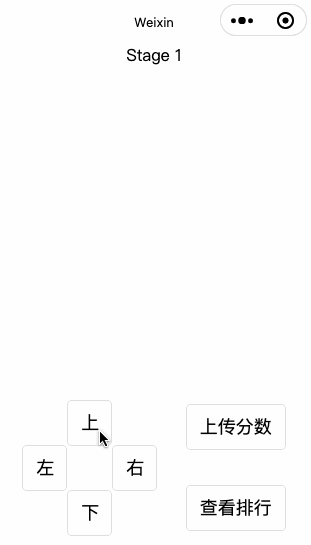

# demo

>这是一个微信小程序的小游戏示例，不是微信小游戏示例。微信小程序和微信小游戏是两种类型。本游戏是在微信小程序中，使用canvas制作的。

关卡的设计，用的是数组，在 `utils/stages.js` 中：

```
    [1, 1, 1, 1, 1, 1, 1, 1],
    [1, 0, 0, 0, 0, 1, 8, 1],
    [1, 1, 0, 1, 0, 0, 0, 1],
    [1, 0, 0, 0, 1, 0, 1, 1],
    [1, 0, 1, 0, 0, 0, 1, 1],
    [1, 0, 1, 0, 1, 1, 0, 1],
    [1, 2, 1, 0, 0, 0, 0, 1],
    [1, 1, 1, 1, 1, 1, 1, 1]
```

